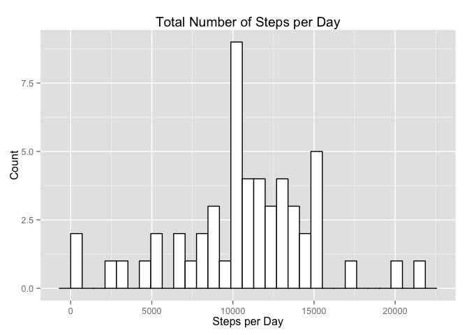
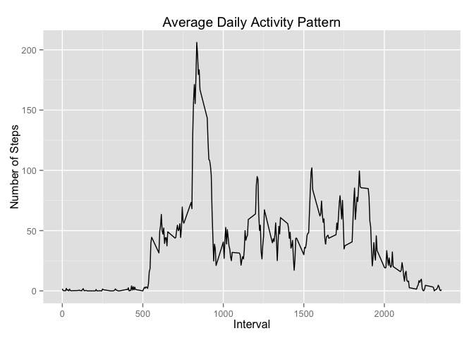
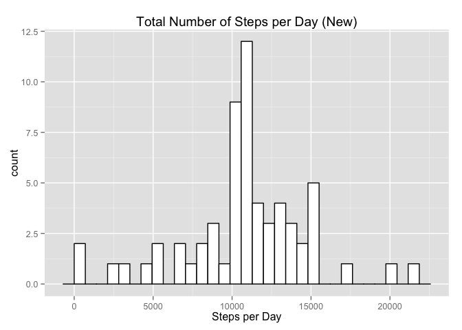
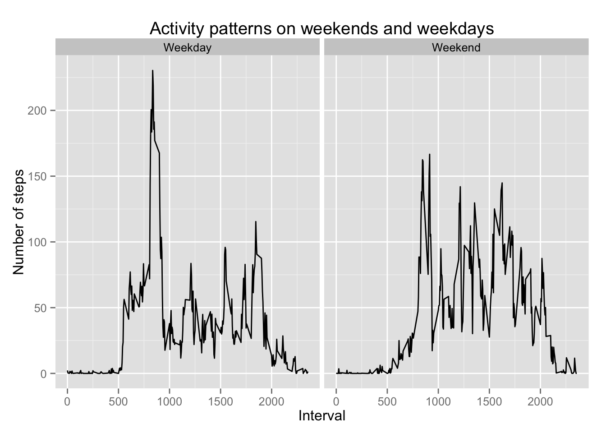

# Peer Assessment 1
# Libraries for analysis

```r
library("plyr")
library("ggplot2")
```

# Loading and preprocessing the data

```r
data <- download.file("http://d396qusza40orc.cloudfront.net/repdata%2Fdata%2Factivity.zip", "data.zip")
data <- unzip("data.zip")
data <- read.csv("activity.csv")
summary(data)
```

```
##      steps                date          interval     
##  Min.   :  0.00   2012-10-01:  288   Min.   :   0.0  
##  1st Qu.:  0.00   2012-10-02:  288   1st Qu.: 588.8  
##  Median :  0.00   2012-10-03:  288   Median :1177.5  
##  Mean   : 37.38   2012-10-04:  288   Mean   :1177.5  
##  3rd Qu.: 12.00   2012-10-05:  288   3rd Qu.:1766.2  
##  Max.   :806.00   2012-10-06:  288   Max.   :2355.0  
##  NA's   :2304     (Other)   :15840
```

# What is mean total number of steps taken per day?

```r
stepsPerDay <- ddply(data, ~date, summarise, steps = sum(steps))
plot <- ggplot(stepsPerDay, aes(steps)) + geom_histogram(fill = "white", color = "black") + ggtitle("Total Number of Steps per Day") + xlab("Steps per Day") + ylab("Count")
plot
```

```
## stat_bin: binwidth defaulted to range/30. Use 'binwidth = x' to adjust this.
```

 

```r
# Mean and Median
stepsMean <- mean(stepsPerDay$steps, na.rm = TRUE)
stepsMedian <- median(stepsPerDay$steps, na.rm = TRUE)
cat("The mean is", stepsMean)
```

```
## The mean is 10766.19
```

```r
cat("The median is", stepsMedian)
```

```
## The median is 10765
```

# Make a time series plot (i.e. type = "l") of the 5-minute interval (x-axis) and the average number of steps taken, averaged across all days (y-axis)

```r
avgSteps <- ddply(data, ~interval, summarise, mean = mean(steps, na.rm = TRUE))
dailyPattern <- ggplot(avgSteps, aes(interval, mean)) + geom_line() + ggtitle("Average Daily Activity Pattern") + xlab("Interval") + ylab("Number of Steps")
dailyPattern
```

 

# Which 5-minute interval, on average across all the days in the dataset, contains the maximum number of steps?
{r, echo=TRUE}
mostSteps <- which.max(avgSteps$mean)
mostInterval <- avgSteps$interval[mostSteps]
cat("5-minute interval that contains maximum number of steps = ", mostInterval)
```

# Calculate and report the total number of missing values in the dataset (i.e. the total number of rows with NAs)

```r
naValues <- sum(apply(is.na(data), 1, any))
cat("NA values = ", naValues)
```

```
## NA values =  2304
```

# Devise a strategy for filling in all of the missing values in the dataset. The strategy does not need to be sophisticated. For example, you could use the mean/median for that day, or the mean for that 5-minute interval, etc.
#Create a new dataset that is equal to the original dataset but with the missing data filled in.

```r
funcReplaceNA <- function(dat){
  ddply(dat, ~interval, function(da){
    steps <- da$steps
    da$steps[is.na(steps)] <- mean(steps, na.rm = TRUE)
    return(da)
  })
}
newData <- funcReplaceNA(data)
```

# Make a histogram of the total number of steps taken each day

```r
newStepsPerDay <- ddply(newData, ~date, summarise, steps = sum(steps))
newPlot <- ggplot(newStepsPerDay, aes(steps)) + geom_histogram(fill = "white", color = "black") + ggtitle("Total Number of Steps per Day (New)") + xlab("Steps per Day")
newPlot
```

```
## stat_bin: binwidth defaulted to range/30. Use 'binwidth = x' to adjust this.
```

 

# Calculate and report the mean and median total number of steps taken per day. Do these values differ from the estimates from the first part of the assignment? What is the impact of imputing missing data on the estimates of the total daily number of steps?

```r
newStepsMean <- mean(newStepsPerDay$steps)
newStepsMedian <- median(newStepsPerDay$steps)
cat("The new mean is ", newStepsMean)
```

```
## The new mean is  10766.19
```

```r
cat("The new median is ", newStepsMedian)
```

```
## The new median is  10766.19
```

```r
cat("There is no difference in the mean", stepsMean, "vs", newStepsMean,". The median is slightly different", stepsMedian, "vs", newStepsMedian,".")
```

```
## There is no difference in the mean 10766.19 vs 10766.19 . The median is slightly different 10765 vs 10766.19 .
```

```r
cat("The total number of steps has changed (", sum(stepsPerDay$steps, na.rm = TRUE), "vs", sum(newStepsPerDay$steps),").")
```

```
## The total number of steps has changed ( 570608 vs 656737.5 ).
```

# For this part the weekdays() function may be of some help here. Use the dataset with the filled-in missing values for this part.
# Create a new factor variable in the dataset with two levels – “weekday” and “weekend” indicating whether a given date is a weekday or weekend day.

```r
weekParts <- function(x){
  if(x %in% c("Saturday", "Sunday")) {
    return("Weekend")
  }
  return("Weekday")
}
newData$day = weekdays(as.Date(newData$date))
newData$weekpart = as.factor(apply(as.matrix(newData$day), 1, weekParts))
```
# Make a panel plot containing a time series plot (i.e. type = "l") of the 5-minute interval (x-axis) and the average number of steps taken, averaged across all weekday days or weekend days (y-axis). See the README file in the GitHub repository to see an example of what this plot should look like using simulated data

```r
avgSteps <- ddply(newData, .(interval, weekpart), summarise, mean = mean(steps))

avgPlot <- ggplot(avgSteps, aes(x = interval, y = mean)) + geom_line() + facet_grid(. ~ weekpart, ) + ggtitle("Activity patterns on weekends and weekdays") + xlab("Interval") + ylab("Number of steps")
avgPlot
```

 
